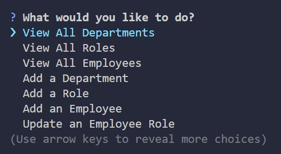

  # Employee-CMS   
  
  ## Description 

  Manage data about employees using the CLI.

  

  ## Table of Contents

  - [Installation](#installation)
  - [Usage](#usage)
  - [License](#license)
  - [Dev](#dev)

  ## Installation

  Clone down the repo. Open src/db in terminal, run the following commands:
  1. psql -U postgres
  2. \i schema.sql;
  3. \i seeds.sql;
  4. \i query.sql;
  
  Next, leave the terminal open running the server, open a new terminal from the src folder, and run the following commands:
  1. npm run build
  2. npm run start

  ## Usage

  Navigate through the options in the CLI using the arrow keys, enter key, and y/n keys to manage data about your employees.

[Demo Video](https://drive.google.com/file/d/15ZBIL4Ajj374PToVouxjzk-4oe7Qlh3_/view?usp=sharing) 

  ## License
  This application is covered under the [MIT](https://opensource.org/licenses/MIT) license.
  

  ## Dev

  Check out the [code](https://github.com/michaelhdavies/employee-cms).

  Developed by [Michael Henry Davies](https://github.com/michaelhdavies/).

  [Back to Top](#description)
  
  